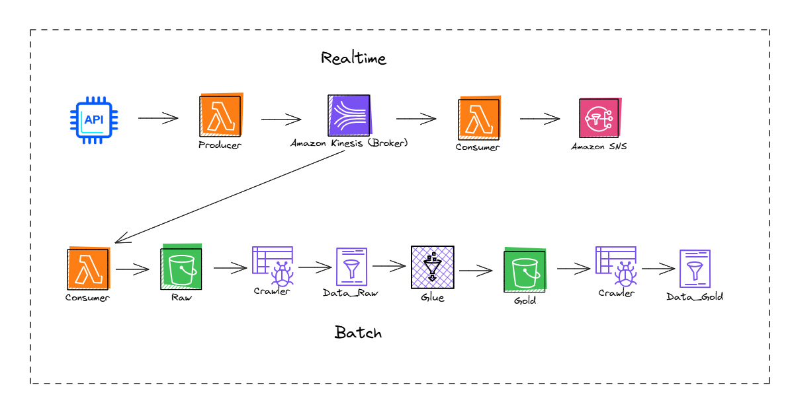

# Weather Stream Pipeline on AWS

Este projeto apresenta um **pipeline de dados** integrado que combina processamento em tempo real e em lote. A arquitetura foi projetada para demonstrar a captura, transformação e entrega de dados com ferramentas modernas e altamente escaláveis.

---

## 📐 Arquitetura

A solução é dividida em dois fluxos principais:

### 1. **Real-time Processing**
- Dados são capturados em tempo real da api **Tomorrow.io** e enviados para o pipeline.
- Um produtor **AWS Lambda** publica esses dados no **Amazon Kinesis**, que atua como um broker.
- Um consumidor **AWS Lambda** processa os eventos recebidos e os encaminha para o **Amazon SNS**, disparando alertas via e-mail e sms.

### 2. **Batch Processing**
- O consumidor **AWS Lambda** salva os dados no bucket **Raw** no **Amazon S3**.
- Um **AWS Glue Crawler** detecta o esquema dos dados e armazena no catálogo como **Data_Raw**.
- Os dados são processados no **AWS Glue**, transformados e armazenados no bucket **Gold** no **Amazon S3**.
- Outro **AWS Glue Crawler** registra os dados transformados como **Data_Gold**, prontos para análise.

---

## 🛠️ Componentes Utilizados

- **Tomorrow.io**: Fonte de dados em tempo real, que disponibiliza informações do clima.
- **AWS Lambda**: Funções serverless para processamento em tempo real.
- **Amazon Kinesis**: Serviço de streaming para ingestão e transporte de eventos em tempo real.
- **Amazon SNS**: Serviço de notificação para envio de mensagens ou integração com outros sistemas.
- **Amazon S3**: Armazenamento escalável para dados brutos e transformados.
- **AWS Glue**: Serviço de ETL para transformação e catalogação dos dados.
- **AWS Glue Crawler**: Ferramenta para catalogar automaticamente os dados armazenados no S3.

---

## 📊 Benefícios do Pipeline

- **Escalabilidade**: Capacidade de lidar com grandes volumes de dados tanto em tempo real quanto em lote.
- **Flexibilidade**: Integração de diferentes serviços AWS permite adaptação conforme os requisitos do projeto.
- **Qualidade de Dados**: O uso do AWS Glue e Crawlers garante a consistência e disponibilidade dos dados para análises.

---

## 🌐 Fluxo Completo

### Real-Time
1. Dados da API → **Lambda Producer** → **Amazon Kinesis** → **Lambda Consumer** → **Amazon SNS**.

### Batch
1. **Lambda Consumer** → Bucket **Raw (S3)** → **Glue Crawler** → **Data_Raw**.
2. **AWS Glue (Transformação)** → Bucket **Gold (S3)** → **Glue Crawler** → **Data_Gold**.

---

